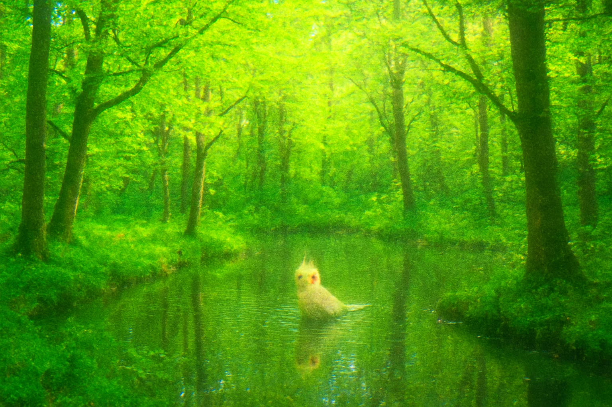

## Hello, Здрасти, Γειά σου or こんにちは

My name is Alexander. I am 22. I love being curious and finding bugs and security vulnerabilities in every nook and cranny.

I study Applied Informatics at New Bulgarian Universitiy.

I am currently working as a Automation Quality Assurance. 

Love playing CTFs and reading security analysis in my space time. Currently getting into reverse engineering.

Btw I have a [personal webiste](https://alexander-garden.me/) where you can see all my projects and interests. There are some blogs too. 👀

